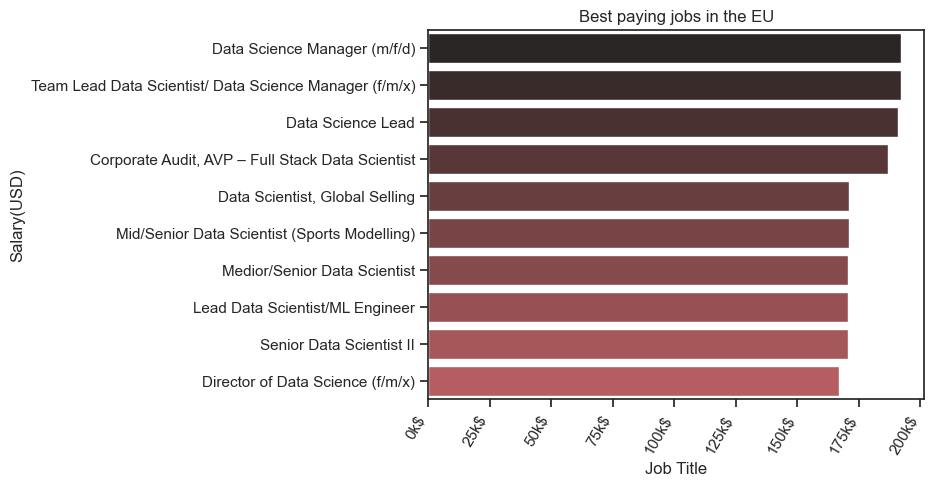

# Introduction 
📊 Dive into the data job market! Focusing on data analyst roles, this project explores 💰 top-paying jobs, 🔥 in-demand skills, and 📈 where high demand meets high salary in Data Science.

🔍 SQL queries? Check them out here: [Project_sql](Project_sql)

# Background
In my job searching in the data field, i realised that the insights i am getting from just looking up job posting sites was not enough. So that is why i decided to find out what are the best paid jobs and skills in this field , using one the most popular data science tool: SQL.

 Data hails from my [SQL Course](https://www.lukebarousse.com/sql). It's packed with insights on job titles, salaries, locations, and essential skills.

 ## The question i wanted to answer through my SQL queries were:
 1. What are the top-paying Data Scientist jobs in the European Union?
 2. What skills are required for these top-paying jobs?
 3. What skills are in most demand for Data Scientists in general?
 4. What are the best paying skills in this field?
 5. What are the most optimal skills a Data Scientist should learn?
  
# Tools I used
- **SQL** : The most important tool in my analysis , allowing me to query the jobs database and find the insights that I need.
- **PostgreSQL** : The chosen database management system.
- **Visual Studio Code** : The code editor where I executed all my queries .
- **Git & GitHub** : Essential for version control and sharing my SQL scripts and analysis, ensuring collaboration and project tracking.

# The Analysis
Each of my queries is designed to get some critical information about the Data Scientist jobs from the job postings market in the European Union.

## 1. Top paying Data Scientist jobs
To indentify the top paying Data Scientist jobs in the European Union, first created a CTE that gets only the data for countries in the European Union, and the I filtered the roles by
their average salary, getting the top 10 best paid titles. 

```sql
-- Create a CTE that contains only the data from the countries in the European Union
WITH EU_jobs AS(
    SELECT *
    FROM job_postings_fact
    WHERE 
    job_country IN ('Austria', 'Belgium', 'Bulgaria', 'Croatia', 'Cyprus', 'Czech Republic', 'Denmark', 
                    'Estonia', 'Finland', 'France', 'Germany', 'Greece', 'Hungary', 'Ireland', 'Italy', 
                    'Latvia', 'Lithuania', 'Luxembourg', 'Malta', 'Netherlands', 'Poland', 'Portugal', 
                    'Romania', 'Slovakia', 'Slovenia', 'Spain', 'Sweden')
)


SELECT
    job_id,
    job_title,
    cd.name AS company_name,
    job_country,
    salary_year_avg
FROM    
    EU_jobs LEFT JOIN company_dim cd ON
    EU_jobs.company_id = cd.company_id
WHERE   
    salary_year_avg IS NOT NULL AND
    job_title_short = 'Data Scientist'
ORDER BY    
    salary_year_avg DESC
LIMIT 10
```
Insights for the data science jobs in 2023:

- **Low salary range** : The salary varies between $165k and $190K Per Year.
- **Diverse employers**: 4 of the postings come from companies in Germany, and the rest from different companies in Europe. There is no company with more than one posting on this list.
- **Job Variety** : Very high diversity in the job titles, such as Senior Data Scientist , Director of Data Science and Lead Data Science, but they all entail qualities of leadership and high experience.


Bar chart visualising the top paying Data Scientist jobs ; This graph was created using Python and the associated libraries(Pandas,Seaborn)

## 2. Skills for the top paying jobs for Data Scientists
Before we dive into the top skills in general, i queried the skills and job posting tables to find out what skills are required for the top jobs presented above.

```sql
-- Create a CTE that contains only the data from the countries in the European Union
WITH EU_jobs AS(
    SELECT *
    FROM job_postings_fact
    WHERE 
    job_country IN ('Austria', 'Belgium', 'Bulgaria', 'Croatia', 'Cyprus', 'Czech Republic', 'Denmark', 
                    'Estonia', 'Finland', 'France', 'Germany', 'Greece', 'Hungary', 'Ireland', 'Italy', 
                    'Latvia', 'Lithuania', 'Luxembourg', 'Malta', 'Netherlands', 'Poland', 'Portugal', 
                    'Romania', 'Slovakia', 'Slovenia', 'Spain', 'Sweden')
)

-- Find the top 5 skills for the best paying job postings in the european union
SELECT
    sd.skills,
    COUNT(sd.skills) AS skills_count
FROM (SELECT
    job_id,
    job_title,
    cd.name AS company_name,
    job_country,
    salary_year_avg
FROM    
    EU_jobs LEFT JOIN company_dim cd ON
    EU_jobs.company_id = cd.company_id
WHERE   
    salary_year_avg IS NOT NULL AND
    job_title_short = 'Data Scientist'
ORDER BY    
    salary_year_avg DESC
LIMIT 10) AS top_30 INNER JOIN skills_job_dim sjd ON 
        top_30.job_id = sjd.job_id INNER JOIN skills_dim sd ON
        sjd.skill_id = sd.skill_id
GROUP BY
    sd.skills
ORDER BY
    skills_count DESC
```


	
