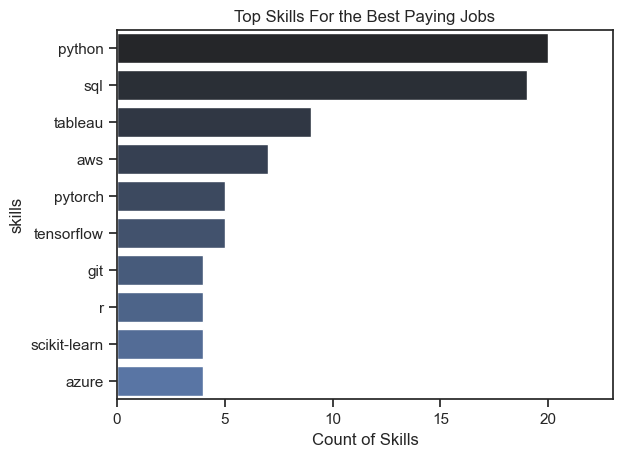
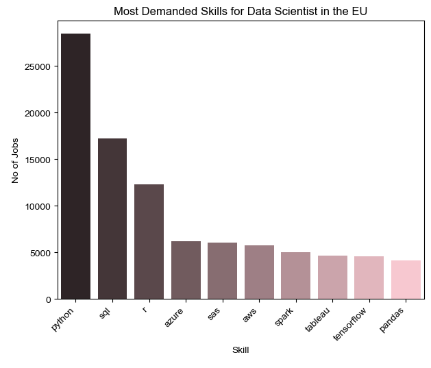

# Introduction 
📊 Dive into the data job market! Focusing on data analyst roles, this project explores 💰 top-paying jobs, 🔥 in-demand skills, and 📈 where high demand meets high salary in Data Science.

🔍 SQL queries? Check them out here: [Project_sql](Project_sql)

# Background
In my job searching in the data field, i realised that the insights i am getting from just looking up job posting sites was not enough. So that is why i decided to find out what are the best paid jobs and skills in this field , using one the most popular data science tool: SQL.

 Data hails from my [SQL Course](https://www.lukebarousse.com/sql). It's packed with insights on job titles, salaries, locations, and essential skills.

 ## The question i wanted to answer through my SQL queries were:
 1. What are the top-paying Data Scientist jobs in the European Union?
 2. What skills are required for these top-paying jobs?
 3. What skills are in most demand for Data Scientists in general?
 4. What are the best paying skills in this field?
 5. What are the most optimal skills a Data Scientist should learn?
  
# Tools I used
- **SQL** : The most important tool in my analysis , allowing me to query the jobs database and find the insights that I need.
- **PostgreSQL** : The chosen database management system.
- **Visual Studio Code** : The code editor where I executed all my queries .
- **Git & GitHub** : Essential for version control and sharing my SQL scripts and analysis, ensuring collaboration and project tracking.

# The Analysis
Each of my queries is designed to get some critical information about the Data Scientist jobs from the job postings market in the European Union.

## 1. Top paying Data Scientist jobs
To indentify the top paying Data Scientist jobs in the European Union, first created a CTE that gets only the data for countries in the European Union, and the I filtered the roles by
their average salary, getting the top 10 best paid titles. 

```sql
-- Create a CTE that contains only the data from the countries in the European Union
WITH EU_jobs AS(
    SELECT *
    FROM job_postings_fact
    WHERE 
    job_country IN ('Austria', 'Belgium', 'Bulgaria', 'Croatia', 'Cyprus', 'Czech Republic', 'Denmark', 
                    'Estonia', 'Finland', 'France', 'Germany', 'Greece', 'Hungary', 'Ireland', 'Italy', 
                    'Latvia', 'Lithuania', 'Luxembourg', 'Malta', 'Netherlands', 'Poland', 'Portugal', 
                    'Romania', 'Slovakia', 'Slovenia', 'Spain', 'Sweden')
)


SELECT
    job_id,
    job_title,
    cd.name AS company_name,
    job_country,
    salary_year_avg
FROM    
    EU_jobs LEFT JOIN company_dim cd ON
    EU_jobs.company_id = cd.company_id
WHERE   
    salary_year_avg IS NOT NULL AND
    job_title_short = 'Data Scientist'
ORDER BY    
    salary_year_avg DESC
LIMIT 10
```
Insights for the data science jobs in 2023:

- **Low salary range** : The salary varies between $165k and $190K Per Year.
- **Diverse employers**: 4 of the postings come from companies in Germany, and the rest from different companies in Europe. There is no company with more than one posting on this list.
- **Job Variety** : Very high diversity in the job titles, such as Senior Data Scientist , Director of Data Science and Lead Data Science, but they all entail qualities of leadership and high experience.


Bar chart visualising the top paying Data Scientist jobs ; This graph was created using Python and the associated libraries(Pandas,Seaborn)

## 2. Skills for the top paying jobs for Data Scientists
Before we dive into the top skills in general, i queried the skills and job posting tables to find out what skills are required for the top jobs presented above.

```sql
-- Create a CTE that contains only the data from the countries in the European Union
WITH EU_jobs AS(
    SELECT *
    FROM job_postings_fact
    WHERE 
    job_country IN ('Austria', 'Belgium', 'Bulgaria', 'Croatia', 'Cyprus', 'Czech Republic', 'Denmark', 
                    'Estonia', 'Finland', 'France', 'Germany', 'Greece', 'Hungary', 'Ireland', 'Italy', 
                    'Latvia', 'Lithuania', 'Luxembourg', 'Malta', 'Netherlands', 'Poland', 'Portugal', 
                    'Romania', 'Slovakia', 'Slovenia', 'Spain', 'Sweden')
)

-- Find the top 5 skills for the best paying job postings in the european union
SELECT
    sd.skills,
    COUNT(sd.skills) AS skills_count
FROM (SELECT
    job_id,
    job_title,
    cd.name AS company_name,
    job_country,
    salary_year_avg
FROM    
    EU_jobs LEFT JOIN company_dim cd ON
    EU_jobs.company_id = cd.company_id
WHERE   
    salary_year_avg IS NOT NULL AND
    job_title_short = 'Data Scientist'
ORDER BY    
    salary_year_avg DESC
LIMIT 10) AS top_30 INNER JOIN skills_job_dim sjd ON 
        top_30.job_id = sjd.job_id INNER JOIN skills_dim sd ON
        sjd.skill_id = sd.skill_id
GROUP BY
    sd.skills
ORDER BY
    skills_count DESC
```



This chart was also created using python and the associated libraries.

Here we have the breakdown of the skill demand for the top paying Data Scientist Jobs:
- **Python** is on the first place with 9 apperances in the top 10 jobs.
- **SQL** follows shorly after with a count of 7.
- **AWS** the cloud computing tool is on the 3rd place.


## 3. In-demand skills for Data Science
Now that we know what skills are needed for the top paying jobs, we can dive deeper to see what the demand distribution for all the jobs in the EU is.
```sql
-- Create a CTE that contains only the data from the countries in the European Union
WITH EU_jobs AS(
    SELECT *
    FROM job_postings_fact
    WHERE 
    job_country IN ('Austria', 'Belgium', 'Bulgaria', 'Croatia', 'Cyprus', 'Czech Republic', 'Denmark', 
                    'Estonia', 'Finland', 'France', 'Germany', 'Greece', 'Hungary', 'Ireland', 'Italy', 
                    'Latvia', 'Lithuania', 'Luxembourg', 'Malta', 'Netherlands', 'Poland', 'Portugal', 
                    'Romania', 'Slovakia', 'Slovenia', 'Spain', 'Sweden')
)

-- Most in demand skills for data scientists in the EU

SELECT
    sd.skills,
    count(sd.skills) as total_skill_count
FROM EU_jobs eu left join skills_job_dim sjd ON
    eu.job_id = sjd.job_id inner join skills_dim sd ON
    sjd.skill_id = sd.skill_id
WHERE
    job_title_short = 'Data Scientist'
GROUP BY
    sd.skills
ORDER BY
    total_skill_count DESC
```
Here's the breakdown of the most demanded skills for data scientists in 2023
- **Python** and **SQL** remain on top, with over 25000 and respectively over 15000 data science job postings
- The programming language **R** takes the third spot with over 10000 postings
- The next spots are taken by cloud platforms(**AZURE** and **AWS**) and tools that can run on both of this cloud service providers(**SAS** and **Apache Spark**)




## 4. The best paid skills for Data Scientists 

After we saw what the most in-demand skills are, now we can take a look at what skills have the biggest average salary.

```sql
-- Find the best paid skills for DATA SCIENTISTS in the EU
SELECT
    sd.skills,
    avg(salary_year_avg) as total_salary
FROM EU_jobs eu left join skills_job_dim sjd ON
    eu.job_id = sjd.job_id inner join skills_dim sd ON
    sjd.skill_id = sd.skill_id
WHERE
    job_title_short = 'Data Scientist' AND
    salary_year_avg IS NOT NULL
GROUP BY
    sd.skills
HAVING 
    COUNT(eu.job_id) > 10
ORDER BY
    total_salary DESC
```

Insights on Top-Paying Skills for Data and Technology Professionals:
- **High Salaries for Cloud and Workflow Management**: Skills in AWS ($134,521.03) and Airflow ($134,509.73) highlight the high demand and value of expertise in cloud infrastructure and automated workflow management.
- **Valuation of Big Data and Machine Learning Tools**: Proficiencies in Hadoop ($128,707.17) and Keras ($128,501.35) reflect the industry's prioritization of big data processing and advanced machine learning capabilities.
- **Importance of Data Analysis and Visualization**: Skills in Pandas ($124,800.42) and Matplotlib ($127,899.20) emphasize the crucial role of data manipulation and visualization in deriving actionable insights from data.
 
| Skills   | Average Salary |
|----------|----------------|
|aws       |134521.03       |
|airflow   |134509.73       |  
|hadoop    |128707.17       |
|keras     |128501.35       |
|matplotlib|127899.20       |
|bigquery  |125554.32       |
|looker    |125313.06       |
|pandas    |124800.42       |
|azure     |124559.46       |
|kubernetes|123454.67       |

*Table presenting the top 10 best paid skills in the Data Science industry*

# 5. Most Optimal Skills to Learn 
Combining insights from demand and salary data, this query aimed to pinpoint skills that are both in high demand and have high salaries, offering a strategic focus for skill development.

```sql
-- Create a CTE that contains only the data from the countries in the European Union
WITH EU_jobs AS(
    SELECT *
    FROM job_postings_fact
    WHERE 
    job_country IN ('Austria', 'Belgium', 'Bulgaria', 'Croatia', 'Cyprus', 'Czech Republic', 'Denmark', 
                    'Estonia', 'Finland', 'France', 'Germany', 'Greece', 'Hungary', 'Ireland', 'Italy', 
                    'Latvia', 'Lithuania', 'Luxembourg', 'Malta', 'Netherlands', 'Poland', 'Portugal', 
                    'Romania', 'Slovakia', 'Slovenia', 'Spain', 'Sweden')
)

-- Find the best paid skills for DATA SCIENTISTS in the EU
SELECT
    sd.skills,
    ROUND(avg(salary_year_avg), 2 ) as total_salary,
    COUNT(eu.job_id) as Demand_count
FROM EU_jobs eu left join skills_job_dim sjd ON
    eu.job_id = sjd.job_id inner join skills_dim sd ON
    sjd.skill_id = sd.skill_id
WHERE
    job_title_short = 'Data Scientist' AND
    salary_year_avg IS NOT NULL
GROUP BY
    sd.skills
HAVING 
    COUNT(eu.job_id) > 10
ORDER BY
    Demand_count DESC,
    total_salary DESC
LIMIT 10
```


| Skills   |Demand Count| Average Salary |
|----------|------------|----------------|
|python    |183         |116950.21       |
|sql       |120         |119255.80       |  
|r         |57          |113120.62       |
|spark     |48          |117688.67       |
|tableau   |46          |122875.79       |
|aws       |37          |134521.03       |
|azure     |37          |124559.46       |
|tensorflow|34          |120000.72       |
|pytorch   |32          |119019.45       |
|scikit    |31          |121510.74       |

Here are the insights:

**Insights on Top-Paying Skills with Demand and Salary Analysis**:
High Demand with Competitive Salaries: **Python** ($116,950.21, demand count: 183) and ****SQL** ($119,255.80, demand count: 120) are in high demand, offering competitive salaries. This indicates that these foundational skills are highly valued in the industry and widely sought after.

**Specialized Skills with High Salaries**: **AWS** ($134,521.03, demand count: 37) and **Azure** ($124,559.46, demand count: 37) command high salaries despite lower demand counts compared to Python and SQL. This reflects the premium placed on cloud computing expertise, even if the number of professionals with these skills is relatively smaller.

**Niche Expertise with High Earning Potential**: Skills like **TensorFlow** ($120,000.72, demand count: 34), **PyTorch** ($119,019.45, demand count: 32), and **scikit-learn** ($121,510.74, demand count: 31) offer high salaries in specialized areas of machine learning, demonstrating significant earning potential for niche expertise in advanced analytics and AI tools.


# Conclusions 
With all the insights found during my analysis using SQL, I can strongly say that this project can act as guide to anyone to any european looking for a Data Scientist job or for someone not knowing where to start their own journey to becoming a Data Scientist.
	
